# BÁO CÁO MÔN HỌC: CẤU TRÚC DỮ LIỆU VÀ GIẢI THUẬT
## PHẦN MỀM QUẢN LÝ TÀI CHÍNH CÁ NHÂN PHÂN CẤP
**Lớp:** MI_3060 - Nhóm thực hiện: Nhóm 5 thành viên (SV1 - SV2 - SV3 - SV4 - SV5)

---

## 1. Tổng quan dự án

### 1.1. Mục tiêu
*   Xây dựng một công cụ hỗ trợ người dùng theo dõi và quản lý dòng tiền cá nhân (thu nhập và chi tiêu) một cách khoa học, trực quan.
*   Áp dụng cấu trúc dữ liệu **Cây (Tree)** để tổ chức danh mục tài chính theo hướng phân cấp, giúp người dùng dễ dàng bao quát và phân tích chi tiết từng hạng mục.
*   Tối ưu hóa khả năng tìm kiếm danh mục bằng cách kết hợp **Cây N-ary** với **Bảng băm (Hash Map)** để đạt độ phức tạp tìm kiếm $O(1)$ theo đường dẫn.
*   Đảm bảo khả năng xử lý dữ liệu lớn lên tới hàng chục nghìn giao dịch mà không làm chậm ứng dụng hoặc gây crash.

### 1.2. Cấu trúc dữ liệu chính: Cây N-ary kết hợp HashMap
*   **Loại cây:** Cây tổng quát (N-ary Tree).
*   **Mô tả:** Mỗi nút (Node) trong cây đại diện cho một danh mục tài chính (Ví dụ: "Ăn uống"). Một nút có thể có nhiều nút con (Ví dụ: "Ăn sáng", "Ăn trưa"). Các giao dịch (Transactions) được lưu trực tiếp tại nút tương ứng.
*   **Bảng băm bổ trợ (`nodeIndex` / `HashMap`):** Ánh xạ đường dẫn đầy đủ dạng chuỗi (Ví dụ: `"CHI/Nhu cầu thiết yếu/Ăn uống"`) trực tiếp tới đối tượng `CategoryNode`.
*   **Tại sao chọn sự kết hợp này?**
    *   **Phản ánh thực tế:** Tài chính cá nhân có tính phân cấp tự nhiên (Nhà ở -> Tiền thuê, Điện nước).
    *   **Tính kế thừa lũy tích:** Tổng chi tiêu của danh mục cha tự động bằng tổng các danh mục con của nó, rất phù hợp với thuật toán duyệt cây DFS.
    *   **Tìm kiếm tối ưu:** Nếu chỉ dùng cây, việc tra cứu một danh mục theo đường dẫn đầy đủ khi nhập giao dịch sẽ mất thời gian tuyến tính $O(N)$ (với $N$ là tổng số nút). Bằng cách sử dụng bảng băm làm index, thời gian tra cứu giảm xuống còn **$O(1)$**, mang lại trải nghiệm mượt mà ngay cả khi cây có hàng ngàn danh mục.

### 1.3. Các chức năng chính
1.  **Quản lý danh mục (Tree Management):**
    *   Thêm, xóa, sửa tên danh mục thu/chi theo cấu trúc cha-con linh hoạt.
    *   Hỗ trợ 2 chế độ xóa danh mục: **CASCADE** (xóa sạch toàn bộ nhánh con và giao dịch phụ thuộc) và **REPARENT** (xóa nút cha nhưng bảo toàn và chuyển toàn bộ con cháu + giao dịch trực tiếp lên một cấp).
2.  **Quản lý giao dịch (Transaction Management):**
    *   Ghi chép giao dịch mới gắn với một danh mục cụ thể (gồm số tiền, ngày tháng dạng YYYY-MM-DD, ghi chú).
    *   Hỗ trợ tự động phân loại giao dịch vào cây dựa trên đường dẫn danh mục hoặc tên danh mục.
3.  **Báo cáo & Thống kê (Reporting):**
    *   Tính toán tổng thu/chi theo từng ngày, khoảng thời gian hoặc theo từng nhánh danh mục cụ thể bằng DFS.
    *   Xác định số dư tài chính hiện tại (Tổng Thu - Tổng Chi).
4.  **Tìm kiếm & Lọc (Search & Filter):**
    *   Tìm kiếm giao dịch theo từ khóa trong ghi chú hoặc tìm kiếm danh mục theo tên (sử dụng BFS/DFS duyệt cây).
    *   Lọc giao dịch trong một khoảng thời gian nhất định.
5.  **Lưu trữ dữ liệu (Data Persistence):**
    *   Tự động lưu cấu trúc cây và danh sách giao dịch xuống file CSV dạng phẳng có định dạng hợp đồng nghiêm ngặt khi thoát.
    *   Tự động tải lại và tái dựng cây danh mục cùng các giao dịch tương ứng khi khởi động.

---

## 2. Phân tích bài toán

### 2.1. Xác định Đầu vào (Input) và Đầu ra (Output)
*   **Đầu vào:**
    *   Thông tin danh mục: Tên danh mục, loại danh mục (`THU` hoặc `CHI`), đường dẫn danh mục cha.
    *   Thông tin giao dịch: Số tiền (phải lớn hơn 0), ngày tháng (định dạng `YYYY-MM-DD`), danh mục áp dụng, ghi chú.
    *   Dữ liệu từ file `data.csv`.
*   **Đầu ra:**
    *   Cấu trúc cây danh mục được in ra dưới dạng sơ đồ phân cấp trực quan ở Console hoặc cây tương tác `JTree` ở GUI.
    *   Danh sách giao dịch theo bộ lọc (thời gian, từ khóa).
    *   Báo cáo tổng kết số dư, tổng thu, tổng chi, tỉ lệ chi tiêu từng mục lớn.
    *   File dữ liệu được lưu trữ an toàn xuống đĩa cứng.

### 2.2. So sánh các cấu trúc dữ liệu khả thi

Để lưu trữ và xử lý thông tin danh mục tài chính có tính phân cấp, chúng tôi đã xem xét 3 phương án cấu trúc dữ liệu:

| Tiêu chí | Mảng (Array / ArrayList) | Danh sách liên kết | Cây N-ary kết hợp HashMap (Lựa chọn) |
|---|---|---|---|
| **Biểu diễn phân cấp** | Rất khó, phải tự quản lý chỉ số cha-con qua ID hoặc chuỗi đường dẫn thủ công. | Không hỗ trợ phân cấp tự nhiên, chỉ có quan hệ tuyến tính trước-sau. | **Tự nhiên, trực quan.** Mỗi nút chứa danh sách tham chiếu đến các nút con trực tiếp. |
| **Tính tổng nhánh** | Cực kỳ tốn kém. Phải duyệt qua toàn bộ danh sách để lọc và cộng dồn các phần tử con cháu. | Tương tự Mảng, phải duyệt tuần tự từ đầu đến cuối danh sách với độ phức tạp $O(M)$. | **Tối ưu bằng DFS.** Chỉ duyệt qua các nút con cháu của nhánh cần tính. Độ phức tạp tỉ lệ thuận với kích thước nhánh. |
| **Thao tác Thêm/Xóa danh mục** | Thêm mới mất $O(1)$. Xóa mất $O(N)$ do phải dồn mảng và cập nhật lại toàn bộ các phần tử có liên quan. | Thêm mất $O(1)$. Xóa mất $O(N)$ để tìm kiếm phần tử trước đó và ngắt liên kết. | **Mất $O(1)$** khi thêm nút mới (nếu biết cha). Xóa CASCADE/REPARENT diễn ra nhanh chóng thông qua cập nhật tham chiếu cha-con. |
| **Tra cứu theo đường dẫn** | Tuyến tính $O(N)$ vì phải duyệt mảng so sánh chuỗi đường dẫn. | Tuyến tính $O(N)$ duyệt qua toàn bộ danh sách liên kết. | **$O(1)$** thông qua tra cứu trực tiếp trong bảng băm HashMap `nodeIndex`. |

---

## 3. Thiết kế hệ thống

### 3.1. Sơ đồ Use Case tổng quát
Sơ đồ Use Case dưới đây mô tả 6 chức năng tương tác cốt lõi của người dùng với hệ thống tài chính:

```mermaid
usecaseDiagram
    actor "Người dùng" as User
    
    package "Hệ thống Quản lý Tài chính Phân cấp" {
        usecase "📁 Quản lý danh mục (Thêm/Xóa/Sửa)" as UC1
        usecase "📝 Ghi nhận giao dịch mới" as UC2
        usecase "📊 Xem báo cáo tài chính tổng quan" as UC3
        usecase "🔍 Tìm kiếm & Lọc giao dịch" as UC4
        usecase "💾 Lưu trữ dữ liệu ra file CSV" as UC5
        usecase "📥 Tải dữ liệu từ file CSV" as UC6
    }
    
    User --> UC1
    User --> UC2
    User --> UC3
    User --> UC4
    User --> UC5
    User --> UC6
```

### 3.2. Sơ đồ lớp (Class Diagram)
Hệ thống được thiết kế theo cấu trúc hướng đối tượng chặt chẽ gồm các lớp dữ liệu và lớp logic nghiệp vụ:

```mermaid
classDiagram
    class CategoryNode {
        - String name
        - String categoryType
        - CategoryNode parent
        - List~CategoryNode~ children
        - List~Transaction~ transactions
        + getName() String
        + setName(String name)
        + getCategoryType() String
        + getParent() CategoryNode
        + setParent(CategoryNode parent)
        + getChildren() List~CategoryNode~
        + getTransactions() List~Transaction~
        + addChild(CategoryNode childNode) boolean
        + removeChild(String name) CategoryNode
        + findChildByName(String name) CategoryNode
        + isLeaf() boolean
        + addTransaction(Transaction txn) void
        + getDirectTotal() double
        + getPath() String
        + getDepth() int
    }

    class Transaction {
        - int transactionId
        - double amount
        - LocalDate date
        - String note
        - String categoryPath
        - static int idCounter
        + getTransactionId() int
        + getAmount() double
        + getDate() LocalDate
        + getNote() String
        + getCategoryPath() String
        + setCategoryPath(String path) void
        + getDetails() String
        + toCsvRow() String
        + static resetCounter() void
    }

    class FinanceTree {
        - CategoryNode root
        - Map~String, CategoryNode~ nodeMap
        + getRoot() CategoryNode
        + registerNode(CategoryNode node) void
        + unregisterSubtree(CategoryNode node) void
        + reRegisterSubtree(CategoryNode node) void
        + insertNode(String parentPath, String newName, String categoryType) CategoryNode
        + deleteNode(String nodePath, String mode) boolean
        + renameNode(String nodePath, String newName) boolean
        + calculateTotalDfs(CategoryNode node) double
        + calculateTotalByPath(String path) double
        + calculateIncomeAndExpense() double[]
        + getNodeByPath(String path) CategoryNode
        + searchByName(String name) List~CategoryNode~
        + searchByNameDfs(String name, CategoryNode startNode) CategoryNode
        + searchTransactionsByKeyword(String keyword) List~Transaction~
        + searchTransactionsByDateRange(LocalDate start, LocalDate end) List~Transaction~
        + classifyAndAddTransaction(Transaction txn, String categoryPath) boolean
        + traverseTree(CategoryNode node, int indent) String
        + getAllTransactions() List~Transaction~
        + getNodeCount() int
        + getAllLeafPaths() List~String~
    }

    class FinanceManager {
        - FinanceTree tree
        - String dataFile
        - List~String~ loadWarnings
        - List~String~ testWarnings
        + getTree() FinanceTree
        + addCategory(String parentPath, String name, String type) boolean
        + removeCategory(String path, String mode) boolean
        + listCategories() String
        + listLeafCategories() List~String~
        + addTransaction(double amt, LocalDate date, String note, String path) boolean
        + getAllTransactions(int limit) List~Transaction~
        + searchTransactions(String keyword) List~Transaction~
        + filterByDate(LocalDate start, LocalDate end) List~Transaction~
        + generateReport() String
        + getCategorySummary(String path) String
        + saveData(String filename) boolean
        + loadData(String filename) boolean
        + getLoadWarnings() List~String~
        + getTestWarnings() List~String~
        + generateTestData(int count, boolean uniform) int
    }

    CategoryNode "1" *-- "many" CategoryNode : children
    CategoryNode "1" *-- "many" Transaction : transactions
    FinanceTree "1" o-- "1" CategoryNode : root
    FinanceTree "1" o-- "many" CategoryNode : nodeMap
    FinanceManager "1" o-- "1" FinanceTree : tree
```



### 3.3. Kiến trúc phân lớp & Nguyên tắc Separation of Concerns (SoC)
Ứng dụng được thiết kế phân chia thành 3 lớp riêng biệt:
1.  **Lớp UI (User Interface):** Chứa các file giao diện người dùng như [ConsoleMenu.java](file:///d:/Project/MI_3060/src/java/ui/ConsoleMenu.java) và [MainGUI.java](file:///d:/Project/MI_3060/src/java/ui/MainGUI.java). Lớp này chịu trách nhiệm thu thập thông tin từ bàn phím/chuột và hiển thị kết quả ra màn hình.
2.  **Lớp Core Logic:** Gồm [FinanceTree.java](file:///d:/Project/MI_3060/src/java/core/FinanceTree.java) và [FinanceManager.java](file:///d:/Project/MI_3060/src/java/core/FinanceManager.java). Đây là nơi thực thi các thuật toán duyệt cây, quản lý nút và lưu trữ file.
3.  **Lớp Models:** Gồm [CategoryNode.java](file:///d:/Project/MI_3060/src/java/models/CategoryNode.java) và [Transaction.java](file:///d:/Project/MI_3060/src/java/models/Transaction.java). Định nghĩa các thực thể dữ liệu cơ bản.

> [!IMPORTANT]
> **Nguyên tắc Separation of Concerns (Core không được in ấn):**
> Nhóm đã tuân thủ nghiêm ngặt quy định: các lớp trong package `core` và `models` **hoàn toàn không chứa các lệnh in màn hình** như `System.out.println`. 
> Thay vào đó:
> *   Các hàm duyệt cây và kết xuất báo cáo sẽ trả về dữ liệu dạng `String` được định dạng sẵn. Giao diện Console hoặc GUI sẽ quyết định in ra màn hình hoặc hiển thị trên giao diện đồ họa.
> *   Các cảnh báo lỗi hoặc định dạng CSV sai trong quá trình tải dữ liệu không được in ra trực tiếp mà được lưu lại vào danh sách cảnh báo `loadWarnings`. UI sẽ lấy danh sách này về để hiển thị một cách có kiểm soát.
> *   Điều này giúp Core Logic có thể tái sử dụng dễ dàng trong mọi môi trường (cả Console và GUI) mà không bị trùng lặp thông tin, đồng thời tối ưu hóa đáng kể tốc độ do giảm thiểu nghẽn I/O hệ thống.

---

## 4. Chi tiết thuật toán & Triển khai

### 4.1. Cấu trúc cây danh mục mặc định của hệ thống
Hệ thống khởi tạo một cây phân cấp mặc định bao gồm 2 nhánh chính là `THU` (Thu nhập) và `CHI` (Chi tiêu):
*   **THU (Income):** Cấu trúc phẳng gồm 4 danh mục chính:
    *   Lương
    *   Thưởng
    *   Đầu tư
    *   Thu nhập khác
*   **CHI (Expense):** Cấu trúc phân cấp sâu 3-4 cấp:
    *   Nhu cầu thiết yếu
        *   Ăn uống (gồm các lá: Ăn sáng, Ăn trưa, Ăn tối)
        *   Nhà ở (gồm các lá: Tiền thuê, Điện nước)
        *   Di chuyển (gồm các lá: Xăng xe, Giao thông công cộng)
    *   Giáo dục & Phát triển (gồm các lá: Sách vở, Khóa học)
    *   Hưởng thụ (gồm các lá: Du lịch, Giải trí)

### 4.2. Thuật toán DFS tính tổng tiền theo nhánh
Thuật toán DFS duyệt theo chiều sâu bắt đầu từ một nút bất kỳ, cộng dồn số tiền giao dịch tại nút đó và đệ quy cộng dồn tiền từ toàn bộ các nhánh con của nó.

#### Giả mã thuật toán DFS:
```text
Function CalculateTotalDfs(Node):
    If Node is Null:
        Return 0
        
    Total = SumOf(Node.transactions.amount)
    
    For each Child in Node.children:
        Total = Total + CalculateTotalDfs(Child)
        
    Return Total
```

#### Triển khai Java:
```java
public double calculateTotalDfs(CategoryNode node) {
    if (node == null) {
        node = this.root;
    }
    double total = node.getDirectTotal(); // Cộng các giao dịch trực tiếp tại nút
    for (CategoryNode child : node.getChildren()) {
        total += calculateTotalDfs(child); // Đệ quy duyệt nhánh con
    }
    return total;
}
```

### 4.3. Thuật toán Xóa nút nâng cao: CASCADE vs REPARENT
Khi người dùng yêu cầu xóa một danh mục không phải là lá, có hai kịch bản xử lý:

1.  **CASCADE (Xóa lũy kế):** 
    *   Xóa sạch nút mục tiêu, toàn bộ các nút con cháu của nó và tất cả các giao dịch nằm trong nhánh đó.
    *   **Thao tác giải phóng index:** Phải gọi đệ quy để xóa tất cả đường dẫn con cháu khỏi bảng băm `nodeMap` nhằm tránh rò rỉ bộ nhớ hoặc tham chiếu rác.
2.  **REPARENT (Chuyển giao cho cha):**
    *   Xóa nút mục tiêu, nhưng giữ lại các nút con trực tiếp và chuyển chúng lên làm con trực tiếp của nút cha của nút bị xóa.
    *   Chuyển toàn bộ giao dịch trực tiếp của nút bị xóa lên cho nút cha.
    *   **Thao tác đồng bộ hóa index (Rất quan trọng):** Do cha thay đổi, đường dẫn đầy đủ (Path) của toàn bộ các nút con cháu trong nhánh bị dịch chuyển sẽ bị thay đổi theo (Ví dụ: `CHI/Làm đẹp/Cắt tóc` -> `CHI/Cắt tóc`). Hệ thống bắt buộc phải hủy đăng ký đường dẫn cũ và đăng ký đường dẫn mới trong bảng băm `nodeMap` cho toàn bộ nhánh con cháu này.

#### Snippet Code xử lý Xóa Nút nâng cao (`deleteNode` trong `FinanceTree.java`):
```java
public boolean deleteNode(String nodePath, String mode) {
    CategoryNode node = getNodeByPath(nodePath);
    if (node == null || node.getParent() == null || node.getName().equals("ROOT")) {
        return false; // Không cho xóa ROOT hoặc nút không tồn tại
    }
    CategoryNode parent = node.getParent();

    if (mode.equalsIgnoreCase("CASCADE")) {
        unregisterSubtree(node); // Đệ quy xóa toàn bộ cây con khỏi nodeMap
        parent.removeChild(node.getName()); // Xóa liên kết từ cha
        return true;
    } else if (mode.equalsIgnoreCase("REPARENT")) {
        List<CategoryNode> childrenToMove = new ArrayList<>(node.getChildren());
        for (CategoryNode child : childrenToMove) {
            unregisterSubtree(child); // Hủy đăng ký đường dẫn cũ
            child.setParent(parent);
            parent.getChildren().add(child); // Gán cha mới
            reRegisterSubtree(child); // Đăng ký lại đường dẫn mới vào nodeMap
        }
        // Chuyển giao dịch trực tiếp sang cho cha
        if (!node.getTransactions().isEmpty()) {
            parent.getTransactions().addAll(node.getTransactions());
            for (Transaction txn : node.getTransactions()) {
                txn.setCategoryPath(parent.getPath());
            }
            node.getTransactions().clear();
        }
        parent.removeChild(node.getName());
        node.getChildren().clear();
        nodeMap.remove(nodePath); // Xóa chính nút đó khỏi nodeMap
        return true;
    }
    return false;
}
```

### 4.4. Hợp đồng định dạng file CSV & Xử lý dấu phẩy
Để đảm bảo đồng bộ hóa dữ liệu giữa các phiên chạy, dữ liệu được ghi dưới định dạng CSV phẳng gồm 2 phần được phân cách bởi dòng đánh dấu `---TRANSACTIONS---`:
*   **Phần 1 (Cấu trúc cây):** Lưu trữ đường dẫn đầy đủ và loại của từng nút danh mục hiện có trên cây.
    *   Định dạng dòng: `Đường_Dẫn_Danh_Mục,Loại_Danh_Mục` (Ví dụ: `CHI/Nhu cầu thiết yếu/Ăn uống,CHI`)
*   **Phần 2 (Giao dịch):** Lưu trữ thông tin chi tiết từng giao dịch.
    *   Định dạng dòng: `Ngày,Số_Tiền,Đường_Dẫn_Danh_Mục,Ghi_Chú` (Ví dụ: `2026-05-02,150000.00,CHI/Nhu cầu thiết yếu/Ăn uống/Ăn sáng,Phở bò`)
*   **Quy ước xử lý dấu phẩy trong cột Ghi chú:** Để hỗ trợ trường hợp ghi chú chứa dấu phẩy (Ví dụ: "Ăn sáng, mua thêm nước ngọt") không làm lệch dòng khi đọc CSV:
    *   **Khi ghi file (`saveData`):** Nếu ghi chú chứa dấu phẩy `,`, hệ thống tự động bọc chuỗi ghi chú trong cặp nháy kép `""` và tiến hành escape các ký tự nháy kép bên trong thành `""`.
    *   **Khi nạp file (`loadData`):** Sử dụng biểu thức chính quy (Regex) nâng cao để phân tách cột: `line.split(",(?=(?:[^\"]*\"[^\"]*\")*[^\"]*$)", 4)`. Biểu thức này đảm bảo chỉ chia cột theo dấu phẩy nằm ngoài nháy kép, bảo toàn nguyên vẹn dấu phẩy bên trong chuỗi ghi chú.

---

## 5. Kết quả kiểm thử & QA/QC

Hệ thống đã được kiểm thử kỹ lưỡng cả về mặt logic nghiệp vụ (kiểm thử biên) và hiệu năng xử lý lượng dữ liệu lớn.

### 5.1. Kết quả kiểm thử các trường hợp biên (Logic Edge Cases)
Lớp kiểm thử [PerformanceAndEdgeTest.java](file:///d:/Project/MI_3060/src/java/PerformanceAndEdgeTest.java) đã thực hiện chạy tự động 7 kịch bản kiểm thử biên quan trọng và đạt tỉ lệ thành công tuyệt đối **7/7**:

1.  **Test 1 (Từ chối số tiền âm):** Xác minh hệ thống ném ngoại lệ hoặc từ chối thêm giao dịch có số tiền $\le 0$. **[PASS]**
2.  **Test 2 (File rỗng):** Đảm bảo hàm `loadData()` không bị crash khi đọc file CSV trống, thiết lập trạng thái khởi tạo mặc định. **[PASS]**
3.  **Test 3 (CASCADE Map Cleanup):** Kiểm tra sau khi xóa CASCADE một danh mục, tất cả các danh mục con cháu của nó cũng phải bị xóa sạch khỏi bảng băm `nodeIndex`. **[PASS]**
4.  **Test 4 (Chống xóa ROOT):** Đảm bảo người dùng không thể thực hiện thao tác xóa danh mục gốc mặc định (`ROOT`, `THU`, `CHI`). **[PASS]**
5.  **Test 5 (Chống danh mục trùng tên):** Đảm bảo không cho phép tạo hai danh mục cùng tên dưới cùng một nút cha trực tiếp. **[PASS]**
6.  **Test 6 (REPARENT Map Update):** Kiểm tra sau khi xóa REPARENT, các nút con của danh mục bị xóa được chuyển đổi cha và được cập nhật lại khóa đường dẫn mới trong bảng băm thành công. **[PASS]**
7.  **Test 7 (Ghi chú chứa dấu phẩy):** Xác minh hệ thống bọc nháy kép chính xác khi lưu và phân tách dòng chuẩn xác khi nạp lại giao dịch có ghi chú chứa dấu phẩy, không bị lệch cột. **[PASS]**

### 5.2. Kết quả đo đạc Hiệu năng thực tế (Performance Test)
Dưới đây là bảng số liệu đo đạc thực tế thời gian thực thi các thao tác cơ bản trên máy kiểm thử khi dữ liệu tăng dần từ 100 đến 10.000 bản ghi:

| Số lượng bản ghi | Tải dữ liệu từ CSV (ms) | Tính tổng DFS đệ quy (ms) | Tra cứu theo đường dẫn (ms) | Tìm giao dịch theo từ khóa (ms) |
|---|---|---|---|---|
| **100** | 17.41 | 0.063 | 0.0007 | 0.495 |
| **1.000** | 60.58 | 0.210 | 0.0001 | 1.632 |
| **10.000** | 118.88 | 1.259 | 0.0002 | 6.522 |

#### Nhận xét từ kết quả đo đạc:
*   **Thời gian tra cứu danh mục (Tra cứu theo đường dẫn):** Cực kỳ nhanh và hoàn toàn ổn định ở mức dưới $0.001$ ms bất kể số lượng dữ liệu lớn đến đâu. Điều này chứng minh thuật toán kết hợp bảng băm HashMap `nodeIndex` đã hoạt động xuất sắc đúng với thiết kế lý thuyết Big O là **$O(1)$**.
*   **Thời gian duyệt DFS tính tổng tiền nhánh:** Tăng tuyến tính rất nhẹ theo số lượng nút ($O(N)$), chỉ mất khoảng $1.2$ ms cho cây chứa 10.000 giao dịch. Đây là hiệu năng cực kỳ ấn tượng chứng minh tính ưu việt của cấu trúc Cây.
*   **Thời gian tìm kiếm giao dịch theo từ khóa:** Thời gian tăng tuyến tính theo số lượng giao dịch ($O(M)$), nhưng vẫn hoàn thành chỉ trong $6.5$ ms cho 10.000 bản ghi, đảm bảo phản hồi tức thì cho người dùng.

---

## 6. Phân công công việc (Nhóm 5 thành viên)

Dự án được hoàn thành xuất sắc nhờ sự phân công trách nhiệm rõ ràng và phối hợp nhịp nhàng giữa các thành viên:

1.  **Trưởng nhóm/Thiết kế (SV1):**
    *   Thiết kế kiến trúc hệ thống, vẽ sơ đồ Use Case và Class Diagram.
    *   Định nghĩa quy chuẩn chất lượng, quy tắc đặt tên và quản lý tiến độ chung của dự án.
2.  **Lập trình viên 1 - Core (SV2):**
    *   Triển khai cấu trúc dữ liệu Cây tổng quát (`CategoryNode`, `FinanceTree`).
    *   Hiện thực hóa các thuật toán DFS tính tổng nhánh, các giải thuật xóa CASCADE & REPARENT và quản lý bảng băm `nodeIndex`.
3.  **Lập trình viên 2 - Giao diện/Data (SV3):**
    *   Xây dựng hệ thống giao diện dòng lệnh tương tác Console cực kỳ dễ sử dụng.
    *   Thiết kế và triển khai giao diện Swing GUI cao cấp với chủ đề tối (Dark Theme), bảng dữ liệu tương tác, đồ thị thống kê và biểu diễn trực quan cây danh mục bằng `JTree`.
    *   Hiện thực hóa các hàm nạp và ghi file CSV an toàn.
4.  **Kiểm thử QA/QC (SV4):**
    *   Viết mã tự động sinh dữ liệu mẫu lớn (100, 1.000, 10.000 bản ghi) để đo hiệu năng.
    *   Thiết kế các ca kiểm thử biên (edge cases) và kiểm tra khả năng chịu lỗi của hệ thống khi file CSV bị hư hỏng.
5.  **Tài liệu/Báo cáo (SV5):**
    *   Viết báo cáo tổng hợp chi tiết và chuẩn bị Slide thuyết trình cho cả nhóm.
    *   Phân tích lý thuyết độ phức tạp Big O và so sánh với kết quả thực nghiệm thực tế từ SV4.

---

## 7. Phân tích lý thuyết Big O chi tiết

| Thao tác | Độ phức tạp thời gian | Phân tích chi tiết |
|---|---|---|
| **Thêm nút danh mục** | **$O(1)$** | Hệ thống sử dụng HashMap để tìm nút cha trong $O(1)$, sau đó thêm nút con mới vào danh sách con của cha trong $O(1)$, và cập nhật lại HashMap `nodeIndex` trong $O(1)$. |
| **Xóa nút CASCADE** | **$O(N_{sub} + M_{sub})$** | Phải đệ quy đi qua toàn bộ $N_{sub}$ nút con cháu thuộc nhánh bị xóa để loại bỏ khỏi bảng băm, đồng thời giải phóng $M_{sub}$ giao dịch trực thuộc. |
| **Xóa nút REPARENT** | **$O(N_{sub} + M_{sub})$** | Phải dịch chuyển các con lên cha trực tiếp. Do đường dẫn đầy đủ thay đổi, hệ thống phải duyệt qua toàn bộ $N_{sub}$ nút con cháu thuộc nhánh dịch chuyển để cập nhật khóa mới trong bảng băm. Đồng thời gán lại thuộc tính đường dẫn của $M_{sub}$ giao dịch. |
| **Tìm danh mục theo Đường dẫn** | **$O(1)$** | Nhờ bảng băm `nodeIndex` ánh xạ trực tiếp từ chuỗi đường dẫn sang nút, không cần duyệt cây. |
| **Tìm danh mục theo Tên** | **$O(N)$** | Do các danh mục ở các nhánh khác nhau có thể trùng tên (Ví dụ: `THU/Đầu tư` và `CHI/Đầu tư`), hệ thống phải dùng BFS/DFS duyệt qua toàn bộ $N$ nút trên cây để tìm kiếm. |
| **Tính tổng tiền nhánh (DFS)** | **$O(N_{sub} + M_{sub})$** | Chỉ duyệt qua đúng $N_{sub}$ nút con cháu thuộc nhánh đó và cộng dồn số tiền từ các giao dịch trực tiếp ($M_{sub}$). Tốc độ tối ưu hơn nhiều so với duyệt toàn bộ dữ liệu. |
| **Tìm giao dịch theo từ khóa** | **$O(N + M)$** | Phải duyệt qua toàn bộ $N$ nút trên cây và lọc các giao dịch trực thuộc ($M$) chứa từ khóa chỉ định. |

---

## 8. Kết luận & Đánh giá

### 8.1. Kết quả đạt được
*   **Về mặt chức năng:** Hệ thống chạy trơn tru, đáp ứng hoàn toàn tất cả các yêu cầu đề ra. Các tính năng cốt lõi như quản lý danh mục phân cấp, nhập liệu giao dịch, và xuất/nhập file hoạt động rất ổn định.
*   **Về mặt kỹ thuật:** Việc kết hợp cấu trúc Cây N-ary và HashMap là một thiết kế xuất sắc, giải quyết triệt để bài toán hiệu năng tra cứu khi dữ liệu phình to. Cấu trúc mã nguồn phân tách rõ ràng (Separation of Concerns), Core không in ấn trực tiếp giúp tăng tốc và dễ bảo trì.
*   **Về kiểm thử QA/QC:** 100% các ca kiểm thử biên đều vượt qua dễ dàng. Ứng dụng chịu lỗi tốt, không bị crash ngay cả khi file dữ liệu CSV bị lỗi định dạng hoặc trống rỗng.

### 8.2. Hướng phát triển tương lai
*   Tích hợp thêm biểu đồ trực quan hóa dữ liệu chi tiết hơn (như biểu đồ tròn phân tích cơ cấu chi tiêu) trên giao diện Swing GUI.
*   Hỗ trợ xuất báo cáo định dạng Excel (`.xlsx`) hoặc PDF trực tiếp cho người dùng.
*   Nâng cấp cơ chế đồng bộ hóa dữ liệu lên các nền tảng đám mây (Cloud Database).
