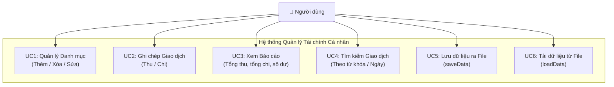
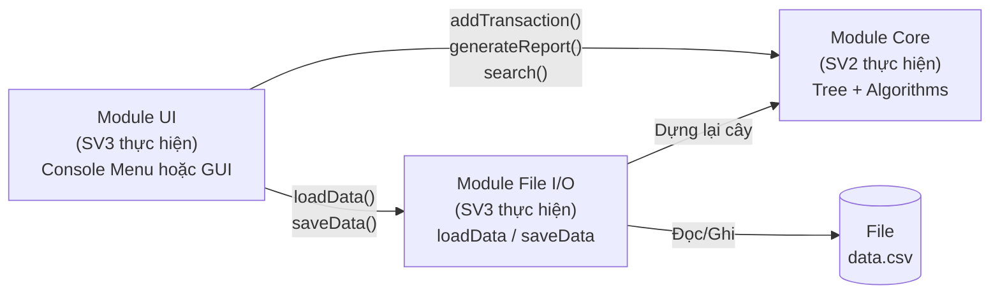
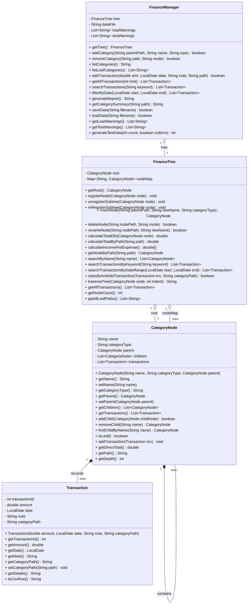

# CHI TIẾT NHIỆM VỤ: TRƯỞNG NHÓM / THIẾT KẾ (SV1)
> **Lưu ý:** File này là tài liệu nội bộ cho SV1. Nội dung được tổng hợp vào `Bao_Cao_Do_An.md` để nộp báo cáo chính thức.

---

## Nhiệm vụ tổng thể
1. Phân tích bài toán và lựa chọn cấu trúc dữ liệu.
2. Xây dựng Sơ đồ Use Case và Sơ đồ lớp (Class Diagram).
3. Định nghĩa **hợp đồng giao diện** (interface contract) giữa các module để SV2, SV3, SV4 làm việc đồng bộ.
4. Phối hợp kết nối, kiểm tra tích hợp cuối cùng.

---

## 1. Phân tích bài toán

### 1.1. Đặc tả đầu vào (Input)

| Dữ liệu | Kiểu | Ràng buộc | Ví dụ |
|---|---|---|---|
| Tên danh mục | String | Không rỗng, ≤ 50 ký tự, duy nhất trong cùng cấp cha | "Ăn uống", "Xăng xe" |
| Loại danh mục | Enum | Chỉ nhận `THU` hoặc `CHI` | `CHI` |
| Danh mục cha | String (path) | Phải tồn tại trong cây | `"CHI/Nhu cầu"` |
| Số tiền | double | > 0, tối đa 999,999,999 | 150000.0 |
| Ngày giao dịch | String | Định dạng `YYYY-MM-DD` hợp lệ | "2024-05-11" |
| Ghi chú | String | Tùy chọn, ≤ 200 ký tự | "Phở buổi sáng" |
| Đường dẫn file | String | File phải tồn tại, định dạng `.csv` | "data.csv" |

### 1.2. Đặc tả đầu ra (Output)

| Đầu ra | Mô tả | Định dạng hiển thị |
|---|---|---|
| Cây danh mục | In phân cấp với thụt đầu dòng | Text (Console) hoặc TreeView (GUI) |
| Tổng thu/chi theo nhánh | Cộng dồn đệ quy từ nút lá lên nút gốc | Số thực, 2 chữ số thập phân |
| Số dư | `TotalIncome - TotalExpense` | Dương = dư, Âm = thâm hụt |
| Kết quả tìm kiếm | Danh sách giao dịch khớp điều kiện | Bảng: Ngày / Số tiền / Danh mục / Ghi chú |
| File CSV | Toàn bộ giao dịch lưu xuống đĩa | `YYYY-MM-DD,amount,Path,note` |

### 1.3. Lý do chọn Cây (Tree) — So sánh với các cấu trúc khác

| Tiêu chí | Mảng (Array) | Danh sách (LinkedList) | **Cây N-ary (Chọn)** ✅ |
|---|---|---|---|
| Phản ánh quan hệ phân cấp | ❌ | ❌ | ✅ Tự nhiên |
| Thêm danh mục con | O(n) phải dịch chuyển | O(1) | **O(1)** nếu có pointer cha |
| Tính tổng theo nhóm | O(n) quét toàn bộ | O(n) | **O(k)** — chỉ duyệt nhánh |
| Xóa nguyên một nhóm danh mục | Phức tạp | Phức tạp | **O(k)** — xóa đệ quy |
| Hiển thị phân cấp trực quan | ❌ | ❌ | ✅ DFS tự nhiên |

---

## 2. Sơ đồ Use Case

### 2.1. Sơ đồ



### 2.2. Mô tả chi tiết từng Use Case

| Use Case | Đầu vào | Đầu ra | Điều kiện biên |
|---|---|---|---|
| **UC1a**: Thêm danh mục | Tên, Loại, Path cha | Cây & `nodeIndex` cập nhật | Tên không trùng trong cùng cấp |
| **UC1b**: Xóa danh mục | Path, Chế độ (CASCADE / REPARENT) | Cây cập nhật, `nodeIndex` xóa key | Không xóa được nút gốc; CASCADE sẽ mất toàn bộ dữ liệu nhánh |
| **UC2**: Ghi giao dịch | Số tiền, Ngày, Path danh mục, Ghi chú | Giao dịch gắn vào nút | Số tiền > 0, Path phải tồn tại trong `nodeIndex` |
| **UC3**: Xem báo cáo | (Không) | Tổng thu, Tổng chi, Số dư | Cây rỗng → hiển thị "Chưa có dữ liệu", không crash |
| **UC4**: Tìm kiếm | Từ khóa (tên/ngày) | Danh sách giao dịch | Trả về danh sách rỗng nếu không tìm thấy, không crash |
| **UC5**: Lưu file | Tên file | File `.csv` được ghi | Cần quyền ghi |
| **UC6**: Tải file | Tên file | Cây được dựng lại | File không tồn tại → bắt đầu dữ liệu trống; dòng lỗi định dạng → bỏ qua và ghi log |

---

## 3. Kiến trúc Module (Hướng dẫn cho SV2, SV3)



**Nguyên tắc bắt buộc (SV1 quy định, mọi thành viên tuân thủ):**
- Module **Core (SV2)**: Không được chứa bất kỳ lệnh `cout`/`printf`/`print` nào. Chỉ xử lý dữ liệu và trả về kết quả.
- Module **UI (SV3)**: Chỉ được hiển thị dữ liệu, không xử lý logic cây.
- Module **File I/O (SV3)**: Giao tiếp với Core thông qua các hàm `addCategory()` và `addTransaction()` đã định nghĩa.

---

## 4. Sơ đồ lớp chi tiết (Class Diagram)



### Giải thích các lớp:

| Lớp | Vai trò | Thành viên thực hiện |
|---|---|---|
| `CategoryNode` | Nút của cây. Lưu danh mục + danh sách giao dịch tại nút đó | **SV2** |
| `Transaction` | Một giao dịch thu hoặc chi | **SV2** |
| `FinanceTree` | Cấu trúc cây tài chính phân cấp, chứa HashMap `nodeIndex` | **SV2** |
| `FinanceManager` | Controller điều phối: quản lý cây, kết nối với File I/O | **SV2** viết Core; **SV3** viết `loadData`/`saveData` |

### Ghi chú thiết kế quan trọng — `nodeIndex`:
*   `Map<String, CategoryNode> nodeIndex` (hay `nodeMap` trong code) là **Bảng băm** ánh xạ đường dẫn đầy đủ (VD: `"CHI/Ăn uống/Ăn sáng"`) → đối tượng nút.
*   **Mục đích:** Tăng tốc tra cứu khi nhập giao dịch mới từ O(N) → **O(1)**.
*   **Đồng bộ hóa:** Mỗi khi thêm/xóa/đổi tên nút, `nodeIndex` phải được cập nhật tương ứng (thêm/xóa key). Đây là trách nhiệm của SV2.
*   **Phân vai rõ ràng:** Cây N-ary dùng để **phân cấp + tính tổng nhánh bằng DFS**; `nodeIndex` dùng để **tìm kiếm nhanh O(1)**. Hai cấu trúc **bổ sung** cho nhau, không thay thế nhau.

---

## 5. Hợp đồng giao diện File CSV (SV2 ↔ SV3)

Đây là quy định **bắt buộc** để SV2 và SV3 làm việc độc lập mà vẫn tương thích:

```
# Format mỗi dòng trong file data.csv:
YYYY-MM-DD,amount,CategoryPath,note

# Ví dụ thực tế:
2024-05-11,150000,CHI/An uong/An sang,Pho buoi sang
2024-05-11,8000000,THU/Luong/Luong chinh,Luong thang 5
2024-05-12,500000,CHI/Di chuyen/Xang xe,Do xang xe may
```

**Quy ước:**
- `CategoryPath` dùng `/` để phân cách cấp bậc.
- Cấp đầu tiên **luôn là** `THU` hoặc `CHI`.
- Khi `loadData()` đọc từng dòng: nếu một cấp trong path chưa tồn tại → **tự động tạo mới** bằng `addCategory()`.

**Quy ước xử lý lỗi khi đọc file (`loadData` — SV3 thực hiện):**

| Trường hợp lỗi | Hành vi yêu cầu |
|---|---|
| File không tồn tại | Thông báo "File chưa có, bắt đầu mới"; không crash |
| File rỗng | Load thành công, 0 giao dịch |
| Dòng thiếu dấu `/` trong path | Bỏ qua dòng đó; in cảnh báo dòng số mấy |
| Số tiền không phải số (`"abc"`) | Bỏ qua dòng đó; in cảnh báo |
| Thiếu cột (dưới 4 phần) | Bỏ qua dòng đó; in cảnh báo |

> **Nguyên tắc bắt buộc:** `loadData()` **KHÔNG ĐƯỢC** ném exception ra ngoài hay crash chương trình. Phải bắt tất cả lỗi bên trong hàm và trả về số dòng đọc thành công.

---

## 6. Cấu trúc Cây Danh mục mặc định

```
ROOT
├── THU (Thu nhập)
│   ├── Lương
│   │   ├── Lương chính
│   │   └── Làm thêm
│   ├── Kinh doanh
│   │   ├── Bán hàng online
│   │   └── Freelance
│   └── Khác
│       ├── Quà tặng
│       └── Lãi tiết kiệm
└── CHI (Chi tiêu)
    ├── Nhu cầu thiết yếu
    │   ├── Ăn uống
    │   │   ├── Ăn sáng
    │   │   ├── Ăn trưa
    │   │   └── Ăn tối
    │   ├── Nhà ở
    │   │   ├── Tiền thuê
    │   │   └── Điện nước
    │   └── Di chuyển
    │       ├── Xăng xe
    │       └── Giao thông công cộng
    ├── Giáo dục & Phát triển
    │   ├── Sách vở
    │   └── Khóa học
    └── Hưởng thụ
        ├── Du lịch
        └── Giải trí
```

---

## 7. Coding Convention (Quy định cho toàn nhóm)

| Quy tắc | Nội dung |
|---|---|
| Tên lớp | PascalCase: `CategoryNode`, `FinanceManager` |
| Tên hàm | camelCase: `addTransaction()`, `generateReport()` |
| Tên biến | camelCase: `incomeRoot`, `categoryPath` |
| Quản lý lỗi | Hàm trả `bool` (true = thành công, false = thất bại). Không dùng exception trong Core. |
| Encoding file | UTF-8 (tránh lỗi tiếng Việt) |
| Comment | Mỗi hàm phải có comment mô tả Input, Output, và điều kiện biên |

---

## 8. Kế hoạch & Mốc thời gian

| Tuần | Nhiệm vụ SV1 | Liên quan |
|---|---|---|
| Tuần 1 | Hoàn thành Sơ đồ lớp, Sơ đồ Use Case, quy định file CSV | Giao cho SV2 và SV3 bắt đầu |
| Tuần 2 | Review code Core của SV2, đảm bảo interface đúng | Kiểm tra SV2 |
| Tuần 3 | Kiểm tra tích hợp giữa SV2 và SV3, hỗ trợ SV4 viết test | Tích hợp |
| Tuần 4 | Kiểm tra báo cáo của SV5, chạy demo tổng thể | Hoàn thiện nộp |
